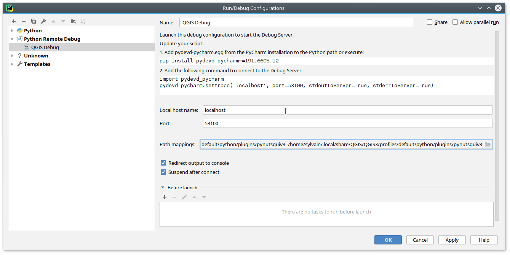

# PyChar
```bash
sudo apt install pyrcc5
```


[TOC]


## Qgis

Configuration de PyCharm pour le développement [^sds]

[d]: www.google.fr	"Coucou"

e plugin Qgis

## QSDF



qdgfS

[^sds]: <QSD

G

